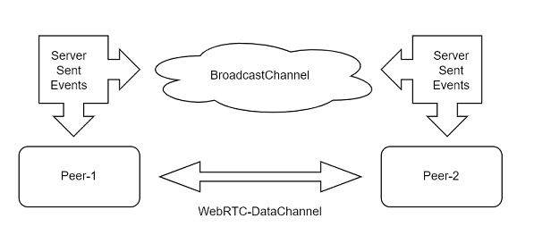

# Fresh Chat RTC

A `fresh` chat app that leverages both Server-Sent-Events, and    
deploys `BroadcastChannel` to create a WebRTC signal server.
This signal server api is then used to connect two peers over a WebRTC-Datachannel.

The advantage of using this communication strategy is that after the    
dataChannel has been negociated, the Signal service is no longer required   
allowing the deploy isolates to terminate gracefully.

[](https://rtc-dice-app-server.deno.dev/)    
 

### Usage

To start the application:

```
deno task start
```

After adding, removing, or moving a page in the `routes` directory,     
or adding, removing, or moving an island in the `islands` directory,     
run:

```
fresh manifest
```
Run it ... https://fresh-chat-rtc.deno.dev/